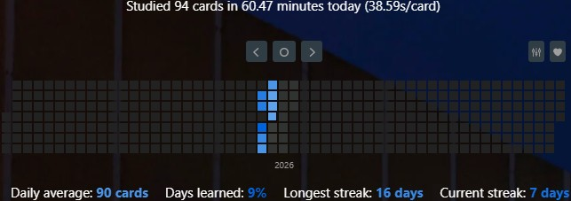

# ✩Welcome to My GitHub Profile!✩
Hi my name is Anselm and I'm a MD-PhD by trade breaking into software development to bring medical knowledge and technical innovation together🫀. Passionate about open-source and always looking to learn, so feel free to reach out if you have a fitting challenge!

ﮩ٨ـﮩﮩ٨ـ♡ﮩ٨ـﮩﮩ٨ـ.ﮩ٨ـﮩﮩ٨ـ♡ﮩ٨ـﮩﮩ٨ـ.ﮩ٨ـﮩﮩ٨ـ♡ﮩ٨ـﮩﮩ٨ـ.ﮩ٨ـﮩﮩ٨ـ♡ﮩ٨ـﮩﮩ٨ـ.

## On LLMs and skill
LLMs made me faster in my research and slower as a developer at the same time. They're closer to slot machines than power tools -> addictive feedback loops, with unpredictable outcome that reward prompting over thinking. Output is not the same as growth, and skills you don't use atrophy.

I keep three daily habits to counter out-sourcing thinking and stay sharp:

- **Trad Coding** - 2h/day, look things up freely, but no code generation. Staying hands-on.
- **Zen Coding** - ~1h/day, fully offline, no internet, standard library only. Currently in Rust, since low-level languages and secure code matter more as AI-generated code grows. (Currently snake in Rust to learn the Elm-architecture with `iced`).
- **Anki** - ~1h/day A spaced repetition memorization software, which already helped me succeed in medschool. I'm currently creating a deck that aims to be "like a basic vocabulary for Rust". Additionally, I recreated Neetcode 150 questions as Rust cards. I aim for 14 cards/day from the basic vocabulary and 1 card/day from the Neetcode questions.

The Anki-Progress will be posted here in irregular intervals (last updated 2026-06-25):

⫘⫘⫘⫘⫘⫘⫘⫘⫘⫘⫘⫘⫘⫘⫘⫘⫘⫘⫘
## Top Languages

## Technologies

## Current main research project

  
  

## Connect with me

	
	
	

